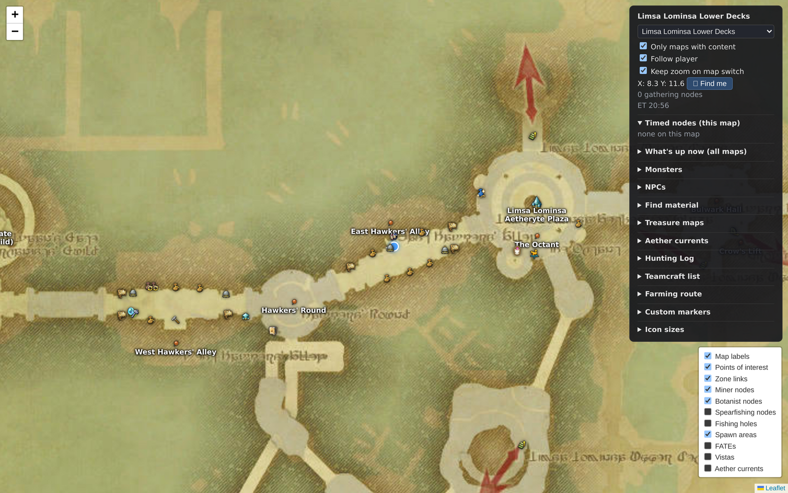
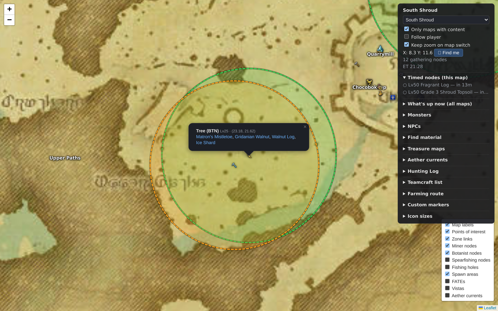
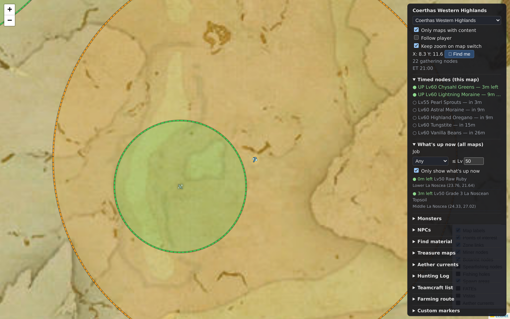
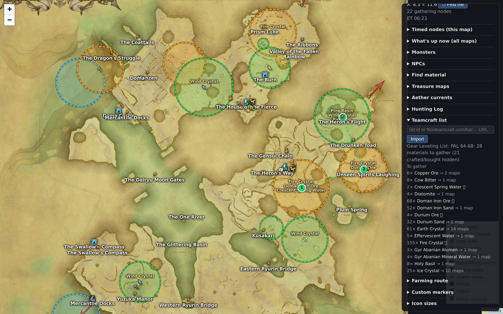
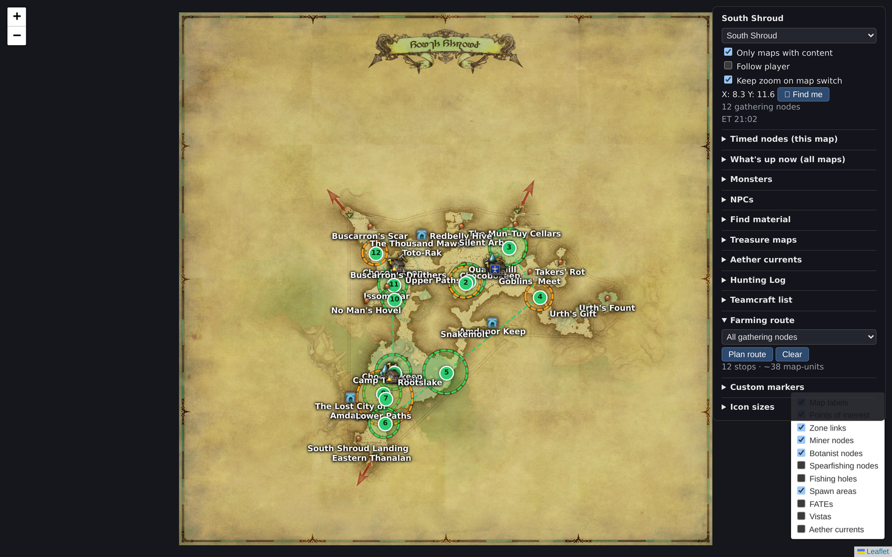

# ffxiv-live-map

Standalone live map for FFXIV: a small Node daemon reads your character's
position from game packets (via Teamcraft's pcap stack) and renders it as a
moving dot on the correct zone map in your browser — together with gathering
nodes (with Eorzea-time windows), monsters, FATEs, NPCs, fishing holes,
treasure dig spots, vistas, aether currents, Hunting Log targets, Teamcraft
list import, and TSP farming routes. No game files touched, no overlay
injection — packets in, WebSocket out.

## Screenshots

**Live player position** — your character (with heading arrow) on the correct
zone map, alongside in-game place labels, specialty POI icons, and clickable
zone links.



**Gathering nodes** — MIN/BTN nodes with dashed spawn-area circles; every popup
links the items straight to GarlandTools.



**Timed nodes & "what's up now"** — live Eorzea-time countdowns; an active node
glows on the map while the global planner lists every unspoiled node currently up.



**Teamcraft list import** — paste a list URL and it pulls Teamcraft's full
ingredient breakdown: a "To gather" checklist with remaining amounts and how
many maps each material spans, gold rings on every matching node, and a route
over them.



**Farming routes** — a TSP-ordered path over a zone's gathering nodes, numbered
from where you're standing.



## A note on packet capture & ToS

Live position comes from [Deucalion](https://github.com/ff14wed/deucalion),
the same packet-capture stack FFXIV Teamcraft uses: a DLL reads the game's
already-decrypted network buffers in-process. Nothing is injected into
gameplay, nothing is sent to the server, and no game files are modified —
but like ALL third-party tools (including Teamcraft itself), this sits in
Square Enix's ToS gray area. Use at your own discretion.

Everything except the live player dot works without packet capture — the
daemon serves all map layers regardless of whether a bridge is connected.

## How it works

```
ffxiv_dx11.exe (Wine / XIV on Mac)
   └─ deucalion.dll  (already injected by Teamcraft's bridge)
        └─ named pipe  ──  deucalion-bridge.exe (Wine)  ──  TCP 127.0.0.1:31594
                                                                │
                                              daemon.mjs (@ffxiv-teamcraft/pcap-ffxiv)
                                                                │  WebSocket
                                                  browser UI (Leaflet, dark mode)
```

Packets used (definitions in [pcap-ffxiv](https://github.com/ffxiv-teamcraft/pcap-ffxiv)):

| Packet | Direction | Gives us |
|---|---|---|
| `InitZone` | S→C | territory id on zone change + spawn position |
| `PlayerSpawn` | S→C | initial position |
| `UpdatePositionHandler` | C→S | position `{x,y,z}` + rotation on every move |
| `UpdatePositionInstance` | C→S | same, inside instances |

Raw world floats are converted to in-game map coordinates with each map's
`size_factor` / `offset_x` / `offset_y` from `data/maps.json` (copied from
ffxiv-teamcraft `libs/data/src/lib/json/maps.json`):

```
c = size_factor / 100
mapCoord = (41 / c) * ((raw + offset) * c + 1024) / 2048 + 1
```

Map images come from xivapi (2048×2048 jpg, URL included per map entry).

## Running

**Prereqs:** Node ≥ 18, FFXIV running, and **FFXIV Teamcraft desktop with
Packet Capture enabled** — Teamcraft injects Deucalion (the packet-capture DLL)
into the game, and this app attaches to it.

```sh
npm install
npm start
```

`npm start` does the whole thing: builds the bundled data on first run, starts a
Deucalion bridge, launches the daemon, and opens the map in your browser at
<http://localhost:8787>. Leave it running and move around in game to see your
dot; press **Ctrl+C** to stop the daemon and the bridge together.

### Browse mode (no capture)

```sh
npm run browse
```

`npm run browse` opens the same map at <http://localhost:8787> but with **no
packet capture** — no Deucalion bridge and no running game required. It's handy
as a reference while you play on PS5 (or any time FFXIV isn't running on this
Mac): pick any map, plan routes, and look things up. You can still toggle capture
on from the UI, and the daemon auto-attaches if it detects the Mac game.

### Desktop app (experimental)

`npm run app` runs the whole stack inside an Electron window instead of a
browser tab — it starts the bridge + daemon for you and opens the map. Run
`npm install` once first to fetch Electron.

**Node ≥ 22.12 is required for the desktop app** — that's Electron 42's floor,
not the daemon's. The browser flow above still runs on Node ≥ 18; only Electron
needs the newer runtime. Browser-only users on Node 18 can skip Electron
entirely (and its engine warnings) with `npm install --omit=dev`.

A frameless, always-on-top, click-through overlay over the game is the next
step; for now it's a normal resizable window.

### Building a `.dmg`

```sh
npm run dist:mac
```

Builds the frontend bundle (esbuild), then packages a macOS `.dmg` into
`release/` with [electron-builder] (arm64 + x64). The app ships the minified web
bundle, runs the daemon in production mode, and bundles the derived `data/`
read-only in its Resources (writing `.state.json` / custom markers to
`~/Library/Application Support/FFXIV Live Map/`). `npm run make-icon` regenerates
the app icon.

The build is **unsigned** (no Apple Developer ID), so on first launch macOS will
say it "is damaged" or "cannot be opened." Clear the quarantine once:

```sh
xattr -cr "/Applications/FFXIV Live Map.app"
```

(or right-click the app → **Open** → **Open**). This is the price of an unsigned
hobby build — the same as running any unsigned `.app`.

[electron-builder]: https://www.electron.build/

### Why a second bridge?

Teamcraft's own bridge (TCP **31594**) accepts exactly one client — once
Teamcraft connects, nothing else can attach there (verified with `lsof`: no
LISTEN socket is left on 31594). Deucalion's named pipe *does* allow multiple
subscribers, so `npm start` launches a **second** bridge on TCP **31595** and
points the daemon at it. `scripts/start-bridge.sh` mirrors Teamcraft's own
launch — XIV on Mac's wine + prefix, the `WINE*SYNC` env, and the
`deucalion-bridge.exe` / `deucalion.dll` from inside the Teamcraft app bundle.
Re-injection is harmless: the DLL is already loaded, the bridge just attaches a
new pipe subscriber.

### Data

The bundled JSON under `data/` is built on first run from the Teamcraft GitHub
repo + XIVAPI v2 (~20s, then cached). It's gitignored — derived, not source.
Force a rebuild after a game patch with `npm run rebuild-data`; the daemon
hot-reloads `data/` on change, so a rebuild doesn't need a restart.

### Manual / advanced

To run the pieces yourself (e.g. a custom port, or to watch the bridge logs),
use two terminals:

```sh
npm run bridge            # 2nd Deucalion bridge on :31595 (keep it running)
npm run start:own-bridge  # daemon on :8787, --bridge-port 31595
```

Daemon flags: `--bridge-port <n>` (daemon default 31594; `npm start` uses
31595), `--http-port <n>` (default 8787), `--verbose`.

## Layers & features

- [x] Live player dot on correct zone map (verified in-game)
- [x] Gathering nodes — MIN/BTN/fishing, dotted spawn-area circles, GarlandTools item links
- [x] Timed/unspoiled nodes — live Eorzea-time countdowns, glow when up, sorted panel
- [x] Monsters — per-mob toggles, clustered spawn counts, FATE-spawn coloring
- [x] FATEs — real icons + levels
- [x] NPCs — search-driven (23k indexed), fly-to on single match
- [x] Hunting Log — 12 class/GC logs (XIVAPI v2 MonsterNote), click a target to jump to its spawns
- [x] Teamcraft list import — Firestore REST read, maps each required item's gathering nodes, checklist + jump
- [x] Custom markers — click-to-place with label, persisted server-side
- [x] Map browser — pick any of ~1200 maps (grouped by region), Follow-player toggle
- [x] Farming routes — nearest-neighbor + 2-opt TSP over node coords, numbered path, starts from your position
- [x] Data served from XIVAPI v2 asset endpoints (v1 host is frozen)
- [x] Fishing holes — 335 fishing-log spots with fish lists; fish resolve in list import + routes
- [x] Treasure dig spots — 965 Timeworn-map spots, per-tier toggles
- [x] Vistas — full Sightseeing Log with ET windows, emote, open-now status
- [x] Aether currents — field-current markers + quest lists (HW+ zones)
- [x] Material search — find any gatherable item (incl. fish), click to jump + ring its nodes
- [x] NPC role toggles — quest givers (gold) and vendors (green)
- [x] Player heading arrow — dot shows facing direction from packet rotation
- [x] Per-category icon-size sliders (persisted)
- [x] In-game map markers — place-name labels, specialty POI icons (aetherytes, market boards, guilds…), clickable zone links (MapMarker sheet)

## Data build

Bundled JSON in `data/` is *derived* data, regenerated from upstream sources:

```sh
node scripts/build-node-data.mjs     # nodes, monsters, fates, npcs, maps, treasure, fishing, item indexes
node scripts/build-hunting-log.mjs   # hunting log (XIVAPI v2 MonsterNote)
node scripts/build-extra-layers.mjs  # vistas + aether currents + NPC roles (XIVAPI v2)
node scripts/build-map-markers.mjs   # map labels, POI icons, zone links (MapMarker sheet)
```

`build-node-data.mjs` pulls Teamcraft's source JSON straight from the
[ffxiv-teamcraft repo](https://github.com/ffxiv-teamcraft/ffxiv-teamcraft/tree/staging/libs/data/src/lib/json)
(staging branch) and caches it under `scripts/.tc-cache/`, so no local checkout
is required. Flags:

- `--local <dir>` — read a local `libs/data/src/lib/json` instead of GitHub
- `--refresh` — bypass the cache and re-download
- `--branch <ref>` — use a different branch/tag (default `staging`)

### Data attribution

Game/world data is sourced from [FFXIV Teamcraft](https://ffxivteamcraft.com)
(node/monster/FATE/NPC/map/fishing/treasure data, MIT-licensed repo) and
[XIVAPI v2](https://v2.xivapi.com) (map images, icons, Hunting Log, vistas,
aether currents). Node and mob spawn positions are community-crowdsourced via
Teamcraft's mappy system. Player position comes from local packet capture
(Deucalion) — no game files are modified.

FINAL FANTASY XIV © SQUARE ENIX CO., LTD. All game content and materials are
trademarks and copyrights of Square Enix. This is an unaffiliated fan tool.

## License

[MIT](LICENSE)
